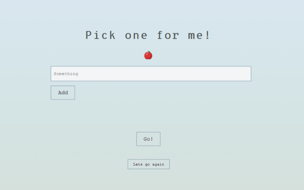

# pick-one

Simple web app that lets the user to enter items, and click "go" to randomly present one of them.

Made with html, css, javascript and jquery.
Based on [Tjejer kodar](https://www.tjejerkodar.se/) course in web development. 
